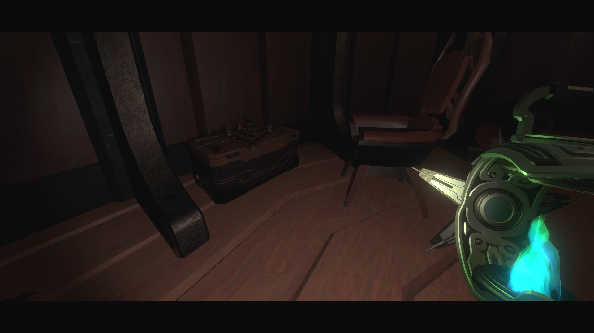

At last, you can play ~~chess~~ their extremely fun and engaging board game. 

## How to Encounter
Set up the conditions for the "Dreamworld" ending, or what is normally needed to access the Prisoner's vault (time loop disabled + trapped in simulation). A *mildly* alternative ending will occur after you finish talking to the Prisoner.

The player can choose to end the game at any time by getting up from their chair and talking to the Prisoner directly.

After saying farewell, a shortcut will unlock at the starting camp. The shortcut only needs to be unlocked once, but you can also edit `ic_save.json` in the mod's folder to enable this manually. *cheater*

Mod options are available in the "Mods" section of the pause menu to toggle the shortcut and some visual effects.

## Rules (at least for now)
(?) - unimplemented but possible

three piece types: **Eye**, **Antler**, **Blocker**
- **Eye**: goal of the antler player, their greatest (and only) threat
    - beam - removes all antlers hit by it from the board
    - infinite range across all tiles (3 lines, like how queen moves/poses a threat in chess)
    - can be "contained" when all legal moves are blocked by the player's pieces
- **Antler**: basically just a pawn for now
    - used to reach the eye - once eye is contained by at least one antler piece
    - (?) can enter blocker for protection
- **Blocker**:
    - used to protect antler pieces
    - can block eye's beam from entering any spaces behind it

2 players: one controls the Eye, other controls Antler/Blockers

The game ends when the player runs out of Antler pieces or reaches the Eye.
